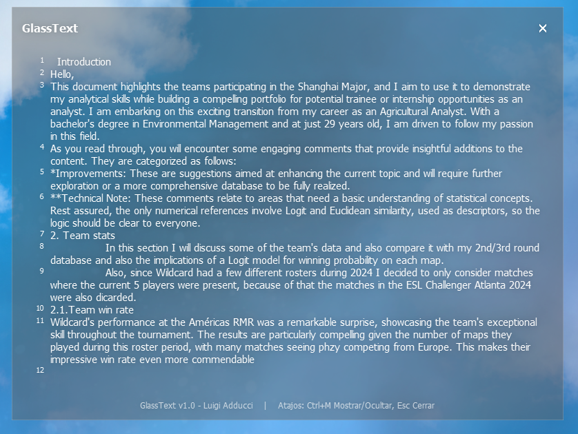

# 🧊 GlassText
---

GlassText es una aplicación minimalista para tomar notas rápidas en una interfaz limpia, veloz y sin distracciones. Ideal para quienes necesitan escribir algo al instante sin abrir editores complejos.

- Interfaz simple y fluida.

- Ideal para ideas rápidas o apuntes temporales.

- Atajos incorporados: Ctrl + M → Ocultar/mostrar la ventana. // ESC → Cerrar la aplicación.
 
<u>Tecnologías utilizadas:</u> Python, PyQt5, ctypes y sys

---
#### Código fuente

 El programa completo está contenido en un único archivo main.py con solo 187 líneas de código. Perfecto para aprender cómo construir interfaces con PyQt5 de forma compacta.

---

<h5>Contribuciones:</h5>

¿Tenés ideas para mejorar GlassText o encontraste un bug? ¡Tus aportes son bienvenidos! Podés contactarme a: luigiadduccidev@gmail.com
